# 📚 Numerical Methods & Analysis — Midterm Study Hub

> [!SUMMARY] 🎓 Vault Master Index
> Welcome to your **Numerical Methods Mid-Term Knowledge Vault**. Every note in this vault is curated for exam excellence, featuring **human-first conceptual analogies**, **rigorous $\LaTeX$ math**, **step-by-step calculator-ready numerical examples**, and **active recall self-test problems**.

---

## 🗺️ Knowledge Graph & Interactive Roadmap

```mermaid
flowchart TD
    NM["Numerical Methods Hub"] --> BC["1. Foundational Concepts"]
    NM --> BM["2. Bracketing Methods (Closed)"]
    NM --> OM["3. Open Methods (Single Eq)"]
    NM --> SLE["4. Iterative Linear Systems"]
    NM --> PRF["5. Polynomial Solvers"]

    BC --> R["[[Roots of Equations]]"]
    BC --> EC["[[Errors and Convergence]]"]

    BM --> BIS["[[Bisection Method]]"]
    BM --> RF["[[Regula Falsi Method]]"]

    OM --> FPI["[[Fixed-Point Iteration]]"]
    OM --> NR["[[Newton-Raphson Method]]"]
    OM --> SEC["[[Secant Method]]"]

    SLE --> GJ["[[Gauss-Jacobi Method]]"]
    SLE --> GS["[[Gauss-Seidel Method]]"]

    PRF --> GRS["[[Graeffe's Root-Squaring Method]]"]
    PRF --> LBM["[[Lin-Bairstow Method]]"]

    NM --> INT["6. Interpolation & Curve Fitting"]

    INT --> LAG["[[Lagrange Interpolation]]"]
    INT --> NDD["[[Newton Divided Difference Interpolation]]"]
    INT --> NFB["[[Newton Forward and Backward Difference Interpolation]]"]
    INT --> CSP["[[Cubic Spline Interpolation]]"]

    NM -.-> FS["[[Numerical Methods Formula Sheet]]"]
```

---

## 📌 Midterm Syllabus Modules

### 1. Foundational Concepts
- **[[Roots of Equations]]**: Geometric meaning of zeros, algebraic vs transcendental equations, simple vs multiple roots, and Bolzano's Intermediate Value Theorem (IVT).
- **[[Errors and Convergence]]**: Absolute ($E_a$), relative ($E_r$), and approximate percentage error ($\epsilon_a$), Scarborough's significant digits criterion, orders of convergence ($p = 1, 1.618, 2$), and robust stopping rules.

### 2. Bracketing (Closed) Methods
*Guaranteed $100\%$ convergence whenever continuous function satisfies $f(a) \cdot f(b) < 0$.*
- **[[Bisection Method]]**: Binary search interval halving, linear convergence ($p=1, C=0.5$), and pre-determining required iterations using $n > \frac{\log_{10}(b_0-a_0) - \log_{10}(\epsilon)}{\log_{10} 2}$.
- **[[Regula Falsi Method]]**: Linear interpolation via secant line $x$-intercepts, the stagnant endpoint trap, and the Illinois halving fix.

### 3. Open Methods for Single Equations
*Higher convergence speed (superlinear/quadratic), but requires starting approximations.*
- **[[Fixed-Point Iteration]]**: Transforming $f(x)=0 \iff x=g(x)$, Lipschitz condition $|g'(x)| < 1$, cobweb diagnostics, and Aitken's $\Delta^2$ acceleration.
- **[[Newton-Raphson Method]]**: Tangent line approximation, quadratic convergence ($p=2$, digits double each step), divisionless reciprocals, Babylonian square roots, and multiple root corrections.
- **[[Secant Method]]**: Finite difference slope approximation, Golden Ratio superlinear convergence ($p \approx 1.618$), and superior computational efficiency index ($I = 1.618 > 1.414$).

### 4. Systems of Linear Equations ($A\mathbf{x} = \mathbf{b}$)
*Iterative solvers for large systems without inverting matrices.*
- **[[Gauss-Jacobi Method]]**: Simultaneous displacement iteration, Jacobi iteration matrix $T_J = D^{-1}(L+U)$, and row-pivoting for Strict Diagonal Dominance (SDD).
- **[[Gauss-Seidel Method]]**: Successive in-place displacement, iteration matrix $T_{GS} = (D-L)^{-1}U$, and $2\times$ faster convergence rule.

### 5. Polynomial Root-Finding
*Extracting all roots (real and complex) of $n$-th degree polynomials.*
- **[[Graeffe's Root-Squaring Method]]**: Direct root separation via successive squarings ($N = 2^m$) without initial guesses, and sign determination with Descartes' Rule.
- **[[Lin-Bairstow Method]]**: Double synthetic division for quadratic factors $x^2 - rx - s$, $2 \times 2$ Jacobian parameter tuning, and quadratic formula extraction.

### 6. Interpolation & Curve Fitting
*Constructing polynomials that pass exactly through discrete data points.*
- **[[Lagrange Interpolation]]**: Basis-polynomial construction of the unique interpolant, the error remainder term $\frac{f^{(n+1)}(\xi)}{(n+1)!} \prod (x - x_i)$, and Runge's Phenomenon.
- **[[Newton Divided Difference Interpolation]]**: Incremental Newton form, divided-difference tables, and top-diagonal coefficients $a_k = f[x_0, x_1, \dots, x_k]$.
- **[[Newton Forward and Backward Difference Interpolation]]**: Equal-spacing finite differences $\Delta$ / $\nabla$ with binomial-coefficient forms for interpolating at the start or end of a table.
- **[[Cubic Spline Interpolation]]**: Piecewise cubics with $C^2$ continuity, natural/clamped boundary conditions, and the tridiagonal $M$-system.

---

## ⚡ High-Yield Revision Sheets
- **[[Numerical Methods Formula Sheet]]**: One-page cheat sheet summarizing all iteration equations, convergence orders, and matrix schemes.
