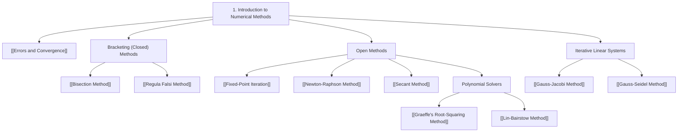

# 📘 Module 1 - Introduction to Numerical Methods

> [!SUMMARY] 🎯 What This Module Covers
> The foundations of numerical analysis: how errors arise and propagate, and the core **iterative methods for solving a single equation $f(x) = 0$** — both the guaranteed bracketing methods and the faster open methods.
> Lecture plan topics: **1-9**.

---

## 🗺️ Module Map

---

## 📌 Topic Breakdown

### Error Analysis (Lecture Topic 2)
- **[[Errors and Convergence]]** — Absolute, relative, and approximate percentage error; Scarborough's significant-digit criterion; orders of convergence $p = 1, 1.618, 2$; stopping rules.

> [!NOTE] Lecture Topic 1 — Overview of Numerical Analysis
> No dedicated note exists for this topic yet. It is the conceptual preamble to the module (why numerical methods are needed, sources of error, the role of approximation).

### Bracketing (Closed) Methods (Lecture Topic 3)
*Guaranteed convergence whenever $f$ is continuous and $f(a)f(b) < 0$.*
- **[[Bisection Method]]** — Interval halving, linear convergence ($p=1$, $C=0.5$), a-priori iteration bound.
- **[[Regula Falsi Method]]** — False position via secant $x$-intercepts, the stagnant-endpoint trap, and the Illinois fix.

### Open Methods for a Single Equation (Lecture Topics 4-6)
*Faster (superlinear/quadratic) but require a starting approximation.*
- **[[Newton-Raphson Method]]** — Tangent iteration, quadratic convergence ($p=2$), square roots, multiple-root corrections.
- **[[Fixed-Point Iteration]]** — $f(x)=0 \iff x=g(x)$, Lipschitz condition $|g'(x)| < 1$, cobweb diagnostics, Aitken's $\Delta^2$ acceleration.
- **[[Secant Method]]** — Finite-difference slope, golden-ratio convergence ($p \approx 1.618$), no derivative required.

### Polynomial Root-Finding (Lecture Topic 7)
*Extracting all real and complex roots of an $n$-th degree polynomial.*
- **[[Graeffe's Root-Squaring Method]]** — Root separation by successive squarings, sign determination via Descartes' Rule.
- **[[Lin-Bairstow Method]]** — Double synthetic division for quadratic factors $x^2 - rx - s$.

### Iterative Linear Systems (Lecture Topics 8-9)
*Solving $A\mathbf{x} = \mathbf{b}$ without inverting the matrix.*
- **[[Gauss-Jacobi Method]]** — Simultaneous displacement, iteration matrix $T_J = D^{-1}(L+U)$, SDD condition.
- **[[Gauss-Seidel Method]]** — Successive in-place displacement, $T_{GS} = (D-L)^{-1}U$, roughly $2\times$ faster.

---

## 🔗 Related Notes
- [[00 - Numerical Methods Index]] — Master vault hub
- [[Numerical Methods Formula Sheet]] — One-page formula reference
- [[02 - Finite Differences, Interpolation and Extrapolation]] — Next module
