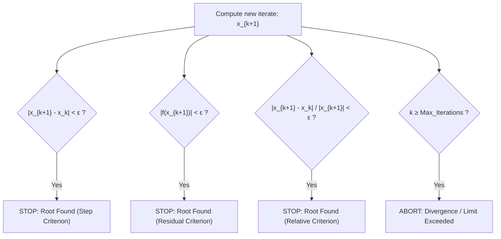

# 📊 Errors, Convergence & Stopping Criteria

> [!NOTE] 💡 The Big Picture Intuition
> If a carpenter makes a $1\text{ cm}$ measuring mistake while building a dining table, it's barely noticeable. But if an aerospace engineer makes a $1\text{ cm}$ mistake on a jet turbine blade, the engine fails catastrophically!
> In numerical methods, we rarely get exact answers; we get **iterative approximations**. Quantifying **errors**, understanding how fast algorithms reach the answer (**order of convergence**), and knowing **when to stop computing** are the core pillars of numerical computing.

---

## 1. Quantification of Errors

Let $x_{\text{true}}$ represent the exact theoretical value, and $x_{\text{approx}}$ represent the computed numerical approximation.

### A. Absolute Error ($E_a$)
The raw distance between the true value and your approximation:
$$E_a = |x_{\text{true}} - x_{\text{approx}}|$$
- *Unit*: Same physical units as the variable $x$.
- *Limitation*: Does not tell you how significant the error is relative to the scale of the object.

### B. Relative Error ($E_r$)
The fraction of the true value that is incorrect (scale-free and dimensionless):
$$E_r = \frac{|x_{\text{true}} - x_{\text{approx}}|}{|x_{\text{true}}|}, \quad x_{\text{true}} \neq 0$$

### C. Percentage Error ($E_p$)
Relative error scaled into a percentage:
$$E_p = E_r \times 100\% = \frac{|x_{\text{true}} - x_{\text{approx}}|}{|x_{\text{true}}|} \times 100\%$$

---

## 2. Approximate Relative Error in Iterative Algorithms ($\epsilon_a$)

In real-world engineering, **we don't know $x_{\text{true}}$** (if we knew it, we wouldn't be running an iterative solver!). Therefore, we compare the newest guess $x_{k+1}$ against the previous guess $x_k$:

> [!IMPORTANT] Iterative Relative Error Formula
> $$\epsilon_a = \left| \frac{x_{k+1} - x_k}{x_{k+1}} \right| \times 100\%, \quad x_{k+1} \neq 0$$
> Iterations are halted once $\epsilon_a < \epsilon_s$, where $\epsilon_s$ is the pre-specified tolerance threshold.

### Significant Digits Criterion (Scarborough's Criterion)
To guarantee that a numerical result is accurate to at least **$m$ significant digits**, iterations must satisfy:
$$\epsilon_a \le 0.5 \times 10^{2-m}\%$$

*Example*: For $m = 3$ significant digits, set $\epsilon_s = 0.5 \times 10^{2-3}\% = 0.5 \times 10^{-1}\% = 0.05\%$.

---

## 3. Order of Convergence ($p$) & Error Growth

Let an algorithm generate approximations $x_0, x_1, x_2, \dots$ converging to the true root $\alpha$.
Define the error at iteration step $k$ as:
$$e_k = |x_k - \alpha|$$

If there exist positive real constants $p \ge 1$ and $C > 0$ such that:
$$\lim_{k \to \infty} \frac{e_{k+1}}{e_k^p} = C$$
then:
- **$p$** is the **Order of Convergence**.
- **$C$** is the **Asymptotic Error Constant** (if $p = 1$, we must have $C < 1$ for convergence).

```
   Linear (p=1):      e_{k+1} ≈ C · e_k          (Error shrinks by constant fraction)
   Superlinear:       e_{k+1} ≈ C · e_k^{1.618}   (Error shrinks faster and faster)
   Quadratic (p=2):   e_{k+1} ≈ C · e_k^2        (Correct decimal digits DOUBLE each step!)
```

### Convergence Speed Classifications

|      Order ($p$)      | Classification  | Error Behavior ($e_{k+1}$)        | Typical Digits Behavior                      | Representative Algorithms                                   |
| :-------------------: | :-------------- | :-------------------------------- | :------------------------------------------- | :---------------------------------------------------------- |
|      **$p = 1$**      | **Linear**      | $e_{k+1} \approx C e_k$ ($C < 1$) | Adds a constant fraction of a digit per step | [[Bisection Method]] ($C = 0.5$), [[Fixed-Point Iteration]] |
| **$p \approx 1.618$** | **Superlinear** | $e_{k+1} \approx C e_k^{1.618}$   | Golden ratio speedup                         | [[Secant Method]]                                           |
|      **$p = 2$**      | **Quadratic**   | $e_{k+1} \approx C e_k^2$         | **Correct digits DOUBLE every iteration**    | [[Newton-Raphson Method]] (simple roots)                    |
|      **$p = 3$**      | **Cubic**       | $e_{k+1} \approx C e_k^3$         | Correct digits TRIPLE every iteration        | Halley's Method                                             |

> [!TIP] 🧠 The "Digit Doubling" Superpower of Quadratic Convergence
> If an algorithm has quadratic convergence ($p=2$) with $C \approx 1$:
> - Step 1: Error $\approx 10^{-1}$ ($1$ accurate decimal place)
> - Step 2: Error $\approx (10^{-1})^2 = 10^{-2}$ ($2$ accurate decimal places)
> - Step 3: Error $\approx (10^{-2})^2 = 10^{-4}$ ($4$ accurate decimal places)
> - Step 4: Error $\approx (10^{-4})^2 = 10^{-8}$ ($8$ accurate decimal places)
> - Step 5: Error $\approx (10^{-8})^2 = 10^{-16}$ (Machine precision reached in just 5 steps!)

---

## 4. Stopping Criteria

Iterative algorithms must terminate cleanly using well-defined stopping rules:



1. **Step Difference Criterion**:
   $$|x_{k+1} - x_k| < \epsilon$$
2. **Residual Criterion (Function Value Near Zero)**:
   $$|f(x_{k+1})| < \epsilon$$
3. **Relative Step Difference Criterion (Scale-Invariant & Most Robust)**:
   $$\frac{|x_{k+1} - x_k|}{|x_{k+1}|} < \epsilon, \quad x_{k+1} \neq 0$$
4. **Safety Counter**:
   $$k \ge N_{\max} \quad (\text{e.g., } 100 \text{ iterations to prevent infinite loops})$$

---

## 5. Worked Step-by-Step Examples

### Worked Example 1: Full Error Analysis on Approximations
> [!EXAMPLE] Problem
> The true value of $\sqrt{2}$ is $x_{\text{true}} \approx 1.41421356$. A numerical method produces consecutive approximations:
> - $x_1 = 1.500000$
> - $x_2 = 1.416667$
>
> Calculate for iteration 2:
> 1. Absolute Error $E_a$
> 2. Relative Error $E_r$
> 3. Percentage Error $E_p$
> 4. Approximate Relative Error $\epsilon_a$

**Step 1: Compute Absolute Error ($E_a$)**
$$E_a = |x_{\text{true}} - x_2| = |1.41421356 - 1.416667| = |-0.00245344| = \mathbf{0.00245344}$$

**Step 2: Compute Relative Error ($E_r$)**
$$E_r = \frac{E_a}{|x_{\text{true}}|} = \frac{0.00245344}{1.41421356} \approx \mathbf{0.00173484}$$

**Step 3: Compute Percentage Error ($E_p$)**
$$E_p = E_r \times 100\% = 0.00173484 \times 100\% = \mathbf{0.1735\%}$$

**Step 4: Compute Approximate Relative Error ($\epsilon_a$)**
Comparing $x_2$ with $x_1$ without knowing $x_{\text{true}}$:
$$\epsilon_a = \left| \frac{x_2 - x_1}{x_2} \right| \times 100\% = \left| \frac{1.416667 - 1.500000}{1.416667} \right| \times 100\% = \left| \frac{-0.083333}{1.416667} \right| \times 100\% = \mathbf{5.882\%}$$

---

### Worked Example 2: Determining Convergence Order from Numerical Data
> [!EXAMPLE] Problem
> An unknown iterative algorithm produces the following error sequence $e_k$ across 4 iterations:
> - $e_0 = 0.20000$
> - $e_1 = 0.04000$
> - $e_2 = 0.00160$
> - $e_3 = 0.00000256$
>
> Determine the order of convergence $p$ and the asymptotic error constant $C$.

**Step 1: Form the error ratios for $p = 1$ (Linear Hypothesis)**
$$\frac{e_1}{e_0} = \frac{0.04}{0.20} = 0.20$$
$$\frac{e_2}{e_1} = \frac{0.0016}{0.04} = 0.04 \neq 0.20 \implies \text{Not linear!}$$

**Step 2: Form the error ratios for $p = 2$ (Quadratic Hypothesis)**
$$\frac{e_1}{e_0^2} = \frac{0.04}{(0.20)^2} = \frac{0.04}{0.04} = 1.00$$
$$\frac{e_2}{e_1^2} = \frac{0.0016}{(0.04)^2} = \frac{0.0016}{0.0016} = 1.00$$
$$\frac{e_3}{e_2^2} = \frac{0.00000256}{(0.0016)^2} = \frac{2.56 \times 10^{-6}}{2.56 \times 10^{-6}} = 1.00$$

**Step 3: Conclusion**
- Since $\frac{e_{k+1}}{e_k^2} = 1.00 = \text{constant}$ for all $k$:
- **Order of Convergence**: **$p = 2$ (Quadratic Convergence)**.
- **Asymptotic Error Constant**: **$C = 1.00$**.

---

## 6. Active Recall & Exam Self-Test

> [!QUESTION] Practice Question: Scarborough Criterion
> If an engineer requires an approximate root to be correct to at least $4$ significant figures, what is the maximum permissible approximate relative error $\epsilon_s$?

> [!SUCCESS]- Step-by-Step Solution
> 1. Use Scarborough's formula with $m = 4$:
>    $$\epsilon_s = 0.5 \times 10^{2-m}\%$$
> 2. Substitute $m = 4$:
>    $$\epsilon_s = 0.5 \times 10^{2-4}\% = 0.5 \times 10^{-2}\% = \mathbf{0.005\%}$$
> 3. The algorithm can safely stop when $\epsilon_a \le 0.005\%$.

---

## 🔗 Related Notes
- [[Roots of Equations]] — Mathematical zeros and existence proofs.
- [[Bisection Method]] — Linear rate ($p=1$, $C=0.5$).
- [[Newton-Raphson Method]] — Benchmark quadratic solver ($p=2$).
- [[Secant Method]] — Superlinear solver ($p \approx 1.618$).
