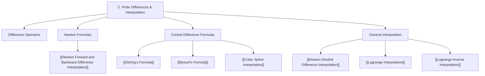

# 📗 Module 2 - Finite Differences, Interpolation and Extrapolation

> [!SUMMARY] 🎯 What This Module Covers
> **Approximating a function's value between known data points.** Starting from the difference operators ($\Delta$, $\nabla$, central differences), this module builds up the classical interpolation polynomials, then the piecewise-spline alternative that avoids high-degree oscillation.
> Lecture plan topics: **9-20**.

---

## 🗺️ Module Map

---

## 📌 Topic Breakdown

> [!NOTE] Lecture Topic 9 — Difference Operators
> Forward ($\Delta$), backward ($\nabla$), average ($\mu$), shift ($E$), and the central difference operator ($\delta$), plus their interrelations. No standalone note yet — the operators are introduced inside [[Newton Forward and Backward Difference Interpolation]].

### Newton's Interpolation Formulas (Lecture Topics 10-11)
- **[[Newton Forward and Backward Difference Interpolation]]** — Equal-spacing finite differences with binomial-coefficient forms; forward for the **start** of a table, backward for the **end**.

> [!NOTE] Lecture Topics 12-13 — Gauss Forward and Gauss Backward Interpolation
> Dedicated Gauss forward/backward interpolation formulas. No note yet. They are the direct precursors to Stirling's and Bessel's formulas (below), which average the Gauss forward and backward results.

### Central Difference Formulas (Lecture Topics 13-15)
- **[[Stirling's Formula]]** — Node-centred central differences, symmetric averaging of forward/backward differences; best accuracy in the **middle** of a table.
- **[[Bessel's Formula]]** — Midpoint-centred variant for targets lying **between** two central nodes; complements Stirling's formula.
- **[[Cubic Spline Interpolation]]** — Piecewise cubics with $C^2$ continuity; natural/clamped/not-a-knot boundary conditions and the tridiagonal $M$-system.

### General Interpolation (Lecture Topics 16-18)
- **[[Newton Divided Difference Interpolation]]** — Incremental construction for **arbitrary** (possibly unequal) spacing; divided-difference tables.
- **[[Lagrange Interpolation]]** — Basis-polynomial form of the unique interpolant, error remainder, Runge's phenomenon.
- **[[Lagrange Inverse Interpolation]]** — Swapping $x$ and $y$ to recover $x$ from a given $y$.

> [!NOTE] Lecture Topics 19-20 — Truncation Error in Polynomial Interpolation
> Estimating the interpolation remainder term $\frac{f^{(n+1)}(\xi)}{(n+1)!}\prod(x-x_i)$. No dedicated note yet — the error term is stated within [[Lagrange Interpolation]].

---

## 🔗 Related Notes
- [[00 - Numerical Methods Index]] — Master vault hub
- [[Numerical Methods Formula Sheet]] — One-page formula reference
- [[01 - Introduction to Numerical Methods]] — Previous module
- [[03 - Numerical Differentiation, Integration and ODE]] — Next module
