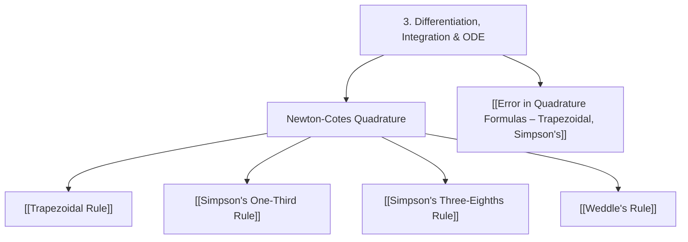

# 📙 Module 3 - Numerical Differentiation, Integration and ODE

> [!SUMMARY] 🎯 What This Module Covers
> **Approximating derivatives and integrals from tabulated data**, plus the numerical solution of differential equations. The quadrature half builds the accuracy ladder from the Trapezoidal Rule ($O(h^2)$) up to Weddle's Rule ($O(h^6)$) and quantifies each rule's error.
> Lecture plan topics: **21-30**.

---

## 🗺️ Module Map

---

## 📌 Topic Breakdown

> [!NOTE] Lecture Topic 21 — Numerical Differentiation Formulas
> Forward/backward/central difference formulas for approximating $f'(x)$, $f''(x)$ from a table. No note yet in this vault.

### Newton-Cotes Quadrature (Lecture Topics 22-24)
*Approximating $\int_a^b f(x)\,dx$ from equally spaced ordinates.*
- **[[Trapezoidal Rule]]** — Chord-top trapeziums, the "ends once, middles twice" weights, exact for linear functions, composite error $-\frac{(b-a)h^2}{12}f''(\xi)$.
- **[[Simpson's One-Third Rule]]** — Parabolic panels (even $n$ required), the 1-4-2-4-…-4-1 weights, exact for cubics, error $-\frac{(b-a)h^4}{180}f^{(4)}(\xi)$.
- **[[Simpson's Three-Eighths Rule]]** — Cubic panels ($n$ a multiple of 3), the 1-3-3-1 binomial weights, hybrid strategies for awkward strip counts.
- **[[Weddle's Rule]]** — Sixth-difference panels ($n$ a multiple of 6), 1-5-1-6-1-5-1 pattern, exact through degree 5.

### Quadrature Error Analysis (Lecture Topic 25)
- **[[Error in Quadrature Formulas – Trapezoidal, Simpson's]]** — Single-panel and composite error terms for every rule, the strip-doubling shrinkage law, and choosing $n$ for a target tolerance.

> [!NOTE] Lecture Topics 26-30 — Solution of ODE and PDE
> Topics with **no notes yet** in this vault:
> - **26** — Picard's method, Taylor's series method (ODE)
> - **27** — Euler and Euler's Modified method (ODE)
> - **28** — Milne Predictor-Corrector method, Chebyshev Polynomial
> - **29** — Runge-Kutta methods (II and IV order) for ODE
> - **30** — Finite difference methods for PDEs
>
> These are the natural next additions to the vault.

---

## 🔗 Related Notes
- [[00 - Numerical Methods Index]] — Master vault hub
- [[Numerical Methods Formula Sheet]] — One-page formula reference
- [[02 - Finite Differences, Interpolation and Extrapolation]] — Previous module
