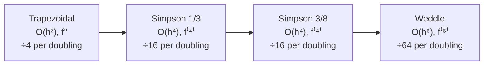

# 📉 Error in Quadrature Formulas — Trapezoidal, Simpson's

> [!NOTE] 💡 The Big Picture Intuition
> Every quadrature rule is really "replace the curve by an interpolating polynomial, then integrate the polynomial." The error is therefore just the **integrated interpolation error** — the same remainder term from [[Lagrange Interpolation]], put through the integral sign.
> The pattern that emerges is beautifully simple: **a rule built on degree-$m$ interpolation has error $\propto h^{m+2} f^{(m+2)}(\xi)$** — one power of $h$ for each extra derivative, one for the integration itself. Each doubling of the number of strips then slashes the error by $2^{m+1}$. Memorize one table (below) and you can predict the accuracy of every rule in the syllabus.

---

## 1. Where the Error Comes From

For a rule derived by interpolating $f$ with a polynomial of degree $m$ through $m+1$ points, the interpolation remainder (see [[Lagrange Interpolation]]) is

$$f(x) - P_m(x) = \frac{f^{(m+1)}(\xi_x)}{(m+1)!}\, q(x), \qquad q(x) = \prod_{i}(x - x_i)$$

Integrating this remainder over the panel gives the quadrature error. For the classical closed Newton–Cotes rules the result simplifies to the standard forms below (with $\xi$ some point in the interval of integration).

> [!IMPORTANT] 🎯 The Governing Principle
> $$\text{Error} \; \propto \; h^{(\text{degree of precision}) + 2} \times f^{(\text{degree of precision}) + 2}(\xi)$$
> A rule of precision $m$ is exact for polynomials of degree $\le m$; its error involves the $(m+2)$-nd derivative — the **first derivative the rule cannot see**. (Simpson's 1/3 is the famous exception-with-a-bonus: precision 3, error in $f^{(4)}$, i.e., $m+1$.)

---

## 2. Master Error Table (Single Application)

> [!IMPORTANT] 🎯 Single-Panel Error Terms
>
> | Rule | Panel | Error $E$ (single application) | Sign structure |
> | :--- | :---: | :--- | :--- |
> | **[[Trapezoidal Rule]]** | $[x_0, x_1]$, width $h$ | $$E_T = -\frac{h^3}{12} f''(\xi)$$ | $\propto f''$ |
> | **[[Simpson's 1/3 Rule]]** | $[x_0, x_2]$, width $2h$ | $$E_{1/3} = -\frac{h^5}{90} f^{(4)}(\xi)$$ | $\propto f^{(4)}$ |
> | **[[Simpson's 3/8 Rule]]** | $[x_0, x_3]$, width $3h$ | $$E_{3/8} = -\frac{3h^5}{80} f^{(4)}(\xi)$$ | $\propto f^{(4)}$ |
> | **[[Weddle's Rule]]** | $[x_0, x_6]$, width $6h$ | $$E_W = -\frac{h^7}{140} f^{(6)}(\xi)$$ | $\propto f^{(6)}$ |
>
> In all cases $\xi$ lies inside the panel; the minus signs indicate the rule **over-estimates** when the leading derivative is positive.

---

## 3. Composite Error Formulas (n strips)

For $n$ panels over $[a, b]$ with $h = \frac{b-a}{n}$, panel errors add up ($n$ panels of width $h$, $2h$, etc.). Since the total width is fixed, each single-panel $h^{k}$ becomes $\frac{(b-a)}{n^{k-1}} h^{k-1}$-type terms:

> [!IMPORTANT] 🎯 Composite Error Formulas
>
> | Rule (composite) | Error $E$ (total, over $[a,b]$) | Order | Error ÷ 4 when $n \to 2n$ |
> | :--- | :--- | :---: | :---: |
> | **Trapezoidal** | $$E_T = -\frac{(b-a)\,h^2}{12} f''(\xi)$$ | $O(h^2)$ | error shrinks by $4\times$ |
> | **Simpson's 1/3** | $$E_{1/3} = -\frac{(b-a)\,h^4}{180} f^{(4)}(\xi)$$ | $O(h^4)$ | error shrinks by $16\times$ |
> | **Simpson's 3/8** | $$E_{3/8} = -\frac{(b-a)\,h^4}{80} f^{(4)}(\xi)$$ | $O(h^4)$ | error shrinks by $16\times$ |
> | **Weddle** | $$E_W = -\frac{(b-a)\,h^6}{840} f^{(6)}(\xi)$$ | $O(h^6)$ | error shrinks by $64\times$ |

### Derivation sketch (Trapezoidal, as the model case)
Sum the single-strip errors $-\frac{h^3}{12}f''(\xi_i)$ over $n$ strips and replace the average of the $f''(\xi_i)$ by $f''(\xi)$ (Mean Value Theorem):
$$E_T = -\frac{h^3}{12} \sum_{i=1}^n f''(\xi_i) = -\frac{h^3}{12}\, n f''(\xi) = -\frac{(b-a)h^2}{12} f''(\xi)$$
The same summation logic produces every composite formula above — only the panel width and derivative order change.

### Per-unit-length comparison of the Simpson rules
- Simpson 1/3: $-\frac{h^5}{90}$ over width $2h$ → $\frac{h^5}{180}$ per unit length
- Simpson 3/8: $-\frac{3h^5}{80}$ over width $3h$ → $\frac{h^5}{80}$ per unit length
- **Conclusion**: for the same $h$, Simpson's 1/3 is about **2.25× more accurate** per unit length than 3/8 — but the two are the same *order*, so the choice is usually dictated by the strip count ($n$ even vs. multiple of 3).

---

## 4. Practical Uses of the Error Formulas

### A. Choosing $n$ for a Target Tolerance
To guarantee $|E_T| \le \epsilon$ with the Trapezoidal Rule, bound the derivative: if $|f''(x)| \le M$ on $[a,b]$,
$$\frac{(b-a)h^2}{12} M \le \epsilon \implies h \le \sqrt{\frac{12\,\epsilon}{(b-a)M}}, \qquad n \ge (b-a)\sqrt{\frac{(b-a)M}{12\epsilon}}$$

### B. Richardson Extrapolation (Romberg's Key Idea)
Because $E_T = C h^2 + O(h^4)$, combining two trapezoidal results with step sizes $h$ and $h/2$ cancels the $h^2$ term:
$$I \approx \frac{4\,I_{h/2} - I_h}{3} \quad (\text{error now } O(h^4) — \text{this is Simpson's accuracy!})$$

### C. A Posteriori Error Estimate
Run a rule at $n$ and $2n$ strips; since $I_h - I \approx C h^p$,
$$|I - I_{2n}| \approx \frac{|I_{2n} - I_n|}{2^p - 1} \quad (p = 2 \text{ trapezoidal}, \; p = 4 \text{ Simpson})$$

---

## 5. Worked Step-by-Step Examples

### Worked Example 1: Theoretical vs Actual Error (Trapezoidal)
> [!EXAMPLE] Problem
> For $\displaystyle\int_0^1 \frac{dx}{1+x^2}$ with $n = 6$, compute the theoretical composite Trapezoidal error bound and compare with the actual error $|0.785398 - 0.784241| = 0.001157$ (from the [[Trapezoidal Rule]] worked example).

**Step 1: Bound the second derivative.** For $f(x) = (1+x^2)^{-1}$:
$$f''(x) = \frac{6x^2 - 2}{(1+x^2)^3}$$
On $[0, 1]$: $f''(0) = -2$, $f''(1/\sqrt{3}) = 0$, $f''(1) = 0.5$ → $\max |f''| = 2$ (at $x = 0$).

**Step 2: Apply the composite error formula.**
$$|E_T| \le \frac{(b-a)h^2}{12}\max|f''| = \frac{1 \times (1/6)^2}{12} \times 2 = \frac{2}{432} \approx \mathbf{0.00463}$$

**Step 3: Compare.**
$$\text{Actual error } 0.001157 \; \le \; \text{Bound } 0.00463 ✅$$
The bound holds (as it must) with room to spare — the actual $f''(\xi)$ averages well below the max. Note the trapezoidal estimate $0.784241$ **under-estimates** here, consistent with the sign structure: $\int_0^{1/\sqrt3}$ is concave (over-estimate there) but the convex region dominates on $[0,1]$.

### Worked Example 2: Predicting the Error Halving Law (Simpson 1/3)
> [!EXAMPLE] Problem
> Simpson's 1/3 Rule with $n = 4$ gives error $\approx 1.1 \times 10^{-4}$ for some integral. Predict the error when $n = 8$, and the number of correct decimal digits gained.

**Step 1: Identify the error order.** $E_{1/3} \propto h^4 \propto \frac{1}{n^4}$.
**Step 2: Apply the doubling law.** Doubling $n$ reduces the error by $2^4 = 16$:
$$E_{n=8} \approx \frac{1.1 \times 10^{-4}}{16} = \mathbf{6.9 \times 10^{-6}}$$
**Step 3: Count digits.** $\log_{10}(1.1\times10^{-4} / 6.9\times10^{-6}) = \log_{10} 16 \approx 1.2$ → about **one extra correct decimal digit** per doubling. (Contrast: Trapezoidal gains only $\log_{10} 4 \approx 0.6$ digits per doubling; Weddle gains $\log_{10} 64 \approx 1.8$.)

### Worked Example 3: Choosing n for a Tolerance
> [!EXAMPLE] Problem
> How many strips are needed to evaluate $\displaystyle\int_0^1 e^{x}\,dx$ by the Trapezoidal Rule with error $< 10^{-4}$?

**Step 1:** $f(x) = e^x \implies |f''(x)| = e^x \le e$ on $[0,1]$, so $M = e \approx 2.71828$.
**Step 2:** Require $\frac{(b-a)h^2}{12}M < 10^{-4}$:
$$\frac{1 \times h^2 \times e}{12} < 10^{-4} \implies h^2 < \frac{12 \times 10^{-4}}{e} \approx 4.4146 \times 10^{-4} \implies h < 0.021011$$
**Step 3:** $n > \frac{1}{0.021011} \approx 47.6 \implies \boxed{n = 48 \text{ strips}}$ (bound at $n = 48$: $9.8 \times 10^{-5} < 10^{-4}$ ✅)

(Check with Simpson 1/3 instead: $\frac{h^4 e}{180} < 10^{-4} \implies h^4 < 6.577 \times 10^{-3} \implies h < 0.2853$, so $n > 3.5 \implies n = 4$ strips — twelve times fewer strips for the same tolerance, a dramatic demonstration of why higher-order rules pay off.)

---

## 6. Active Recall & Exam Self-Test

> [!QUESTION] Practice Question: Why is Simpson's 1/3 error in $f^{(4)}$ and not $f^{(3)}$?
> The rule interpolates with a quadratic (degree 2), so naive reasoning predicts error $\propto f'''$. Explain the discrepancy.

> [!SUCCESS]- Step-by-Step Solution
> 1. The naive derivation gives $E = -\frac{h^5}{90}f^{(4)} + \text{(higher order)}$ — but let's see why the $f^{(3)}$ term vanishes.
> 2. Over a symmetric panel $[-h, h]$, the interpolation error involves $\omega(x) = (x+h)\,x\,(x-h)$ — an **odd** function.
> 3. For the error term $\frac{f^{(3)}(\xi)}{3!}\omega(x)$: integrating an odd function over a symmetric interval gives contributions that cancel when $f^{(3)}$ is constant.
> 4. Rigorously (Peano kernel theory): the rule is exact for quadratics, and the next term that survives is proportional to $f^{(4)}$.
> 5. **Moral**: Simpson's 1/3 gets "degree 3 precision for free" from panel symmetry — the reason it is the best value rule in the syllabus.

---

> [!QUESTION] Practice Question: Match each rule to its composite error
> Without looking, write the composite error term for each of the four rules and state how much the error shrinks when the number of strips is doubled.

> [!SUCCESS]- Step-by-Step Solution
> 1. **Trapezoidal**: $E = -\frac{(b-a)h^2}{12}f''(\xi)$ → shrinks by $2^2 = 4\times$.
> 2. **Simpson 1/3**: $E = -\frac{(b-a)h^4}{180}f^{(4)}(\xi)$ → shrinks by $2^4 = 16\times$.
> 3. **Simpson 3/8**: $E = -\frac{(b-a)h^4}{80}f^{(4)}(\xi)$ → shrinks by $2^4 = 16\times$.
> 4. **Weddle**: $E = -\frac{(b-a)h^6}{840}f^{(6)}(\xi)$ → shrinks by $2^6 = 64\times$.
> 5. Memory aid: recall the denominators as $12,\ 180,\ 80,\ 840$ and the derivatives as $2,\ 4,\ 4,\ 6$.

---

## 7. Summary: The Accuracy Ladder



| Rule | Strips needed | Precision | Composite order | Best when… |
| :--- | :---: | :---: | :---: | :--- |
| Trapezoidal | any $n$ | 1 | $O(h^2)$ | data is noisy or $n$ arbitrary |
| Simpson 1/3 | even $n$ | 3 | $O(h^4)$ | default workhorse |
| Simpson 3/8 | $n \equiv 0 \pmod 3$ | 3 | $O(h^4)$ | odd-strip hybrids with 1/3 |
| Weddle | $n \equiv 0 \pmod 6$ | 5 | $O(h^6)$ | maximum accuracy, smooth $f$ |

---

## 💻 Python Implementation

```python
import math

def composite_error_bound(rule, a, b, n, max_deriv):
    """
    Theoretical composite error bound for the classical quadrature rules.

    Parameters:
        rule:      'trapezoidal' | 'simpson13' | 'simpson38' | 'weddle'
        a, b:      integration limits
        n:         number of strips
        max_deriv: bound M on the relevant derivative of f over [a, b]
                   (f'' for trapezoidal, f^(4) for Simpson, f^(6) for Weddle)

    Returns:
        Upper bound on the absolute error |I_exact - I_rule|.
    """
    h = (b - a) / n
    constants = {
        'trapezoidal': (h**2 / 12,     2),
        'simpson13':   (h**4 / 180,    4),
        'simpson38':   (h**4 / 80,     4),
        'weddle':      (h**6 / 840,    6),
    }
    coeff, p = constants[rule]
    return (b - a) * coeff * max_deriv   # E ≈ (b-a)·h^p/C · f^(p)(ξ)


# Example: trapezoidal bound for ∫₀¹ dx/(1+x²), n = 6, max|f''| = 2
bound = composite_error_bound('trapezoidal', 0, 1, 6, 2)
print(f"Error bound: {bound:.5f}")        # Output: 0.00463
print(f"Actual error: 0.00116")           # from the Trapezoidal Rule worked example ✅ bound holds
```

---

## 🔗 Related Notes
- [[Trapezoidal Rule]] — The $O(h^2)$ baseline and its geometric bias
- [[Simpson's 1/3 Rule]] — Derivation and the free-cubic-precision bonus
- [[Simpson's 3/8 Rule]] — Cubic panels and hybrid strategies
- [[Weddle's Rule]] — The $O(h^6)$ sixth-difference rule
- [[Errors and Convergence]] — General error quantification ($E_a$, $E_r$, orders)
- [[Lagrange Interpolation]] — The remainder term all of this grows from
