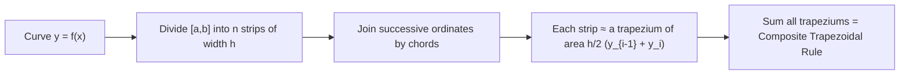

# 📏 Trapezoidal Rule (Numerical Integration)

> [!NOTE] 💡 The Big Picture Intuition
> Suppose you must find the area of an irregular pond with no formula available. You can't integrate — you only have depth measurements at equally spaced points across it. The **Trapezoidal Rule** says: *connect the measured depths with straight lines and sum up the areas of the resulting trapeziums.*
> It's the "connect-the-dots with rulers" approach to integration — simple, robust, and the baseline against which all fancier quadrature rules ([[Simpson's 1/3 Rule]], [[Simpson's 3/8 Rule]], [[Weddle's Rule]]) are judged. Every curved top is flattened into a chord, which slightly **under-estimates** convex (cap-up $\cup$) regions and **over-estimates** concave (cap-down $\cap$) regions.

---

## 1. Problem Statement & Setup

We want the definite integral
$$I = \int_a^b f(x)\, dx$$
but either $f(x)$ is unknown (only tabulated data exists) or $f(x)$ has no elementary antiderivative.

**Setup**: divide $[a, b]$ into $n$ **equal subintervals** of width
$$h = \frac{b - a}{n}$$
with nodes $x_0 = a,\; x_1 = a + h,\; \dots,\; x_n = b$ and ordinates $y_i = f(x_i)$.

---

## 2. Derivation in One Sentence

On each subinterval $[x_{i-1}, x_i]$, replace $f(x)$ by its **chord** (the straight line through the two endpoints — i.e., Newton's forward interpolation truncated after the first difference, or equivalently linear [[Lagrange Interpolation]]) and integrate:

$$\int_{x_{i-1}}^{x_i} f(x)\,dx \approx \int_{x_{i-1}}^{x_i} \left[ y_{i-1} + \frac{(x - x_{i-1})}{h}(y_i - y_{i-1}) \right] dx = \frac{h}{2}\left( y_{i-1} + y_i \right)$$

— the area of a trapezium $= \frac{(\text{sum of parallel sides}) \times \text{height}}{2}$.

---

## 3. The Trapezoidal Rule Formulas

> [!IMPORTANT] 🎯 Single Application (one trapezium, 2 points)
> $$\int_a^b f(x)\,dx \approx \frac{h}{2}\left[ y_0 + y_1 \right], \qquad h = b - a$$

> [!IMPORTANT] 🎯 Composite Trapezoidal Rule ($n$ subintervals, $n+1$ points)
> $$\int_a^b f(x)\,dx \approx \frac{h}{2}\Big[ y_0 + 2(y_1 + y_2 + \dots + y_{n-1}) + y_n \Big]$$
> or, in compact summation form:
> $$I \approx \frac{h}{2}\left[ (y_0 + y_n) + 2\sum_{i=1}^{n-1} y_i \right]$$

> [!TIP] 💡 The "Ends Once, Middles Twice" Memory Hook
> The two **end ordinates** ($y_0, y_n$) get coefficient $1$; every **interior ordinate** gets coefficient $2$ (because each interior point is shared by two adjacent trapeziums). Multiplier out front: $\frac{h}{2}$.

**Operator form** (useful for deriving the error): using Newton's forward-difference expansion with only $\Delta y_0$ retained,
$$\int_{x_0}^{x_0 + nh} y \, dx \approx nh\left[ y_0 + \frac{n}{2}\Delta y_0 \right]$$

---

## 4. Geometric Interpretation



- If $f$ is **convex** ($f'' > 0$, cup-shaped $\cup$): chords lie **above** the curve → trapezoidal rule **over-estimates**.
- If $f$ is **concave** ($f'' < 0$, cap-shaped $\cap$): chords lie **below** the curve → trapezoidal rule **under-estimates**.
- If $f$ is **linear**: chords coincide with the curve → the rule is **exact** (error $= 0$).

---

## 5. Worked Step-by-Step Example

### Worked Example 1: Composite Trapezoidal Rule
> [!EXAMPLE] Problem
> Evaluate $\displaystyle\int_0^1 \frac{dx}{1 + x^2}$ using the composite Trapezoidal Rule with $n = 6$ subintervals. Give the answer to 4 decimal places.

**Step 1: Compute the step size**
$$h = \frac{b - a}{n} = \frac{1 - 0}{6} = \frac{1}{6} \approx 0.166667$$

**Step 2: Tabulate the ordinates $y_i = \dfrac{1}{1 + x_i^2}$**

| $i$ | $x_i$ | $y_i = \frac{1}{1+x_i^2}$ |
| :---: | :---: | :---: |
| 0 | $0$ | $1.000000$ |
| 1 | $1/6$ | $0.972973$ |
| 2 | $1/3$ | $0.900000$ |
| 3 | $1/2$ | $0.800000$ |
| 4 | $2/3$ | $0.692308$ |
| 5 | $5/6$ | $0.590164$ |
| 6 | $1$ | $0.500000$ |

**Step 3: Identify end and interior ordinates**
- Ends: $y_0 + y_6 = 1.000000 + 0.500000 = 1.500000$
- Interior sum: $y_1 + \dots + y_5 = 0.972973 + 0.900000 + 0.800000 + 0.692308 + 0.590164 = 3.955445$

**Step 4: Apply the composite formula**
$$I \approx \frac{h}{2}\Big[ (y_0 + y_6) + 2\sum_{i=1}^{5} y_i \Big] = \frac{0.166667}{2}\Big[ 1.500000 + 2(3.955445) \Big]$$
$$I \approx 0.083333 \times \big[ 1.500000 + 7.910890 \big] = 0.083333 \times 9.410890 = \mathbf{0.784241}$$

**Step 5: Compare with the exact value**
$$\int_0^1 \frac{dx}{1+x^2} = \left[\arctan x\right]_0^1 = \frac{\pi}{4} \approx 0.785398$$
$$\text{Error} = |0.785398 - 0.784241| \approx \mathbf{0.001157}$$

> [!SUCCESS] ✅ Sanity Check
> The exact value is larger than the approximation here ($\arctan$ curve bends both ways on $[0,1]$, with a net under-estimate). The observed error $\approx 1.2 \times 10^{-3}$ sits comfortably inside the theoretical bound $|E_T| \le \dfrac{(b-a)h^2}{12}\,\max|f''| = \dfrac{1 \times (1/6)^2}{12} \times 2 = 4.6 \times 10^{-3}$ — consistent with the $O(h^2)$ error law derived in [[Error in Quadrature Formulas – Trapezoidal, Simpson's]].

---

## 6. Active Recall & Exam Self-Test

> [!QUESTION] Practice Question: Why must the interior ordinates be doubled?
> In the composite Trapezoidal Rule, why do interior ordinates $y_1, \dots, y_{n-1}$ carry a coefficient of 2?

> [!SUCCESS]- Step-by-Step Solution
> 1. Each interior ordinate $y_i$ serves as the **right edge** of trapezium $i$ **and** the **left edge** of trapezium $i+1$.
> 2. Summing strip areas $\frac{h}{2}(y_{i-1} + y_i)$ over all $n$ strips counts every interior ordinate **twice**.
> 3. Only the two boundary ordinates $y_0, y_n$ belong to a single strip each, so they keep coefficient $1$.

---

> [!QUESTION] Practice Question: What class of functions does the rule integrate exactly?
> For which functions is the Trapezoidal Rule exact (zero error), and why?

> [!SUCCESS]- Step-by-Step Solution
> 1. The rule replaces $f$ by a **straight line** (degree-1 polynomial) on each strip.
> 2. Hence it is exact for any function whose graph is linear on the interval — i.e., **polynomials of degree $\le 1$**.
> 3. Formally, its error term contains $f''(\xi)$ (see [[Error in Quadrature Formulas – Trapezoidal, Simpson's]]), which vanishes when $f$ is linear.
> 4. Its **degree of precision is 1** — one less than Simpson's rules (degree 3).

---

## 💻 Python Implementation

```python
def trapezoidal_rule(f, a, b, n):
    """
    Composite Trapezoidal Rule.

    Parameters:
        f: function to integrate
        a, b: integration limits
        n: number of subintervals (strips)

    Returns:
        Approximation of the integral of f from a to b.
    """
    h = (b - a) / n
    total = 0.5 * (f(a) + f(b))          # end ordinates (coefficient 1)
    for i in range(1, n):
        total += f(a + i * h)            # interior ordinates (coefficient 2)
    return h * total


# Example usage:
import math

approx = trapezoidal_rule(lambda x: 1 / (1 + x**2), 0, 1, 6)
exact = math.atan(1)  # pi/4

print(f"Trapezoidal (n=6): {approx:.6f}")   # Output: 0.784241
print(f"Exact (pi/4):      {exact:.6f}")   # Output: 0.785398
print(f"Error:             {abs(exact - approx):.6f}")  # Output: 0.001157
```

---

## 🔗 Related Notes
- [[Simpson's 1/3 Rule]] — Parabolic upgrade, error $O(h^4)$
- [[Simpson's 3/8 Rule]] — Cubic-strip alternative for $n$ divisible by 3
- [[Weddle's Rule]] — Sixth-difference rule for $n$ a multiple of 6
- [[Error in Quadrature Formulas – Trapezoidal, Simpson's]] — Full error analysis of all quadrature rules
- [[Newton Forward and Backward Difference Interpolation]] — Where the rule's derivation comes from
