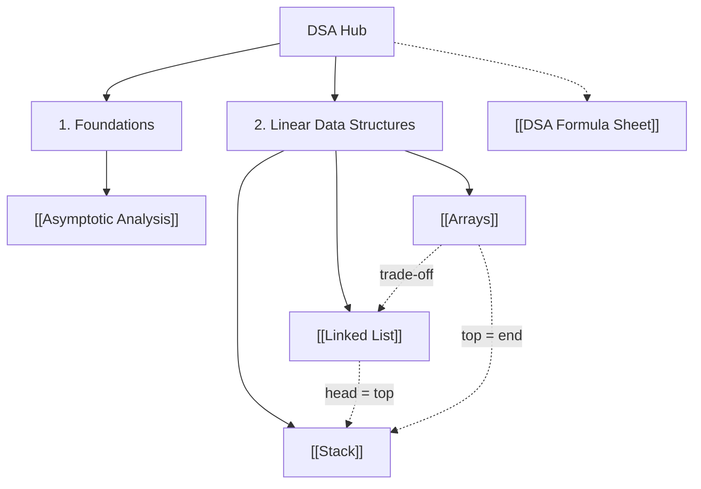

# 🧠 Data Structures & Algorithms — Midterm Study Hub

> [!SUMMARY] 🎓 Subject Master Index
> Welcome to the **DSA Mid-Term Knowledge Vault**. Every note follows the vault standard: **human-first analogies**, **rigorous $\LaTeX$ math**, **step-by-step worked examples**, and **active recall self-tests** with collapsible solutions.

---

## 🗺️ Knowledge Graph & Interactive Roadmap

---

## 📌 Midterm Syllabus Modules

### 1. Foundations
*The vocabulary every other note depends on.*
- **[[Asymptotic Analysis]]**: $O$ / $\Omega$ / $\Theta$ bounds, the complexity ladder from $O(1)$ to $O(n!)$, drop-constants/drop-lower-order rules, best–average–worst cases, loop-analysis worked examples (Gauss-sum triangle loop, doubling loop → $\log n$), and space complexity including recursion depth.

### 2. Linear Data Structures
*The contiguous vs pointer-based trade-off axis.*
- **[[Arrays]]**: contiguous memory and the address formula $\text{base} + i \times w$, why random access is $O(1)$, the shifting tax of middle inserts ($O(n - i)$), static vs dynamic arrays (amortized doubling), and row-major 2D addressing $\text{base} + (iC + j)w$.
- **[[Linked List]]**: node anatomy (`data` + `next`/`prev`), the three flavours — **singly** (one-way, minimal memory), **doubly** (two-way, $O(1)$ deletion of a known node), **circular** (ring traversal, round-robin/Josephus) — head/tail insertion, the 3-pointer reversal, and the full array-vs-list trade-off table.
- **[[Stack]]**: LIFO discipline with `push`/`pop`/`peek`/`isEmpty` all $O(1)$, array-backed (top = end) vs linked (head = top) implementations, and the classic applications: balanced parentheses, infix → postfix conversion, postfix evaluation, undo/history, backtracking, and the call stack.

---

## ⚡ High-Yield Revision Sheets
- **[[DSA Formula Sheet]]**: one-page cheat sheet of complexity tables, address formulas, and conversion rules. *(Planned — create when revising.)*

---

## 🔗 Cross-Subject Links
- Complexity notation is shared with the ANM vault: see [[Errors and Convergence]] for how iteration counts (Bisection's $\frac{\log_{10}(b_0-a_0)-\log_{10}\epsilon}{\log_{10}2}$) mirror $O(\log n)$ reasoning.
