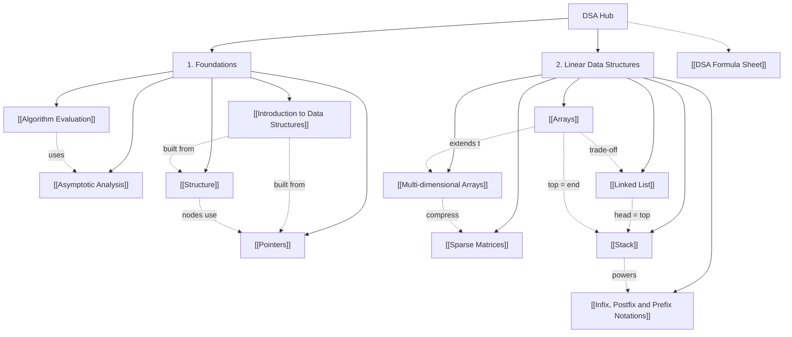

# 🧠 Data Structures & Algorithms — Midterm Study Hub

> [!SUMMARY] 🎓 Subject Master Index
> Welcome to the **DSA Mid-Term Knowledge Vault**. Every note follows the vault standard: **human-first analogies**, **rigorous $\LaTeX$ math**, **step-by-step worked examples**, and **active recall self-tests** with collapsible solutions.

---

## 🗺️ Knowledge Graph & Interactive Roadmap

---

## 📌 Midterm Syllabus Modules

### 1. Foundations
*The vocabulary and the C/C++ building blocks every other note depends on.*
- **[[Introduction to Data Structures]]**: what a data structure is (the D–A–F triplet), primitive vs non-primitive data, the linear/non-linear × static/dynamic classification, ADTs (interface vs implementation), and the core operation menu with costs.
- **[[Algorithm Evaluation]]**: algorithm properties (finiteness, definiteness, effectiveness…), evaluation criteria, **apriori vs apostiori** analysis, design-technique toolbox, and a three-way search evaluation worked example.
- **[[Asymptotic Analysis]]**: $O$ / $\Omega$ / $\Theta$ bounds, the complexity ladder from $O(1)$ to $O(n!)$, drop-constants/drop-lower-order rules, best–average–worst cases, loop-analysis worked examples (Gauss-sum triangle loop, doubling loop → $\log n$), and space complexity including recursion depth.
- **[[Pointers]]**: addresses as data (`&`, `*`, `->`, `nullptr`), pointer arithmetic $\text{addr}(p{+}k) = \text{addr}(p) + k \times w$, stack vs heap, `new`/`delete`, dangling pointers, and the swap-by-pointer trace.
- **[[Structure]]**: heterogeneous records, declaration vs definition, member access, `sizeof` and padding (order-largest-first rule), structure vs array, and `offsetof` verification.

### 2. Linear Data Structures
*The contiguous vs pointer-based trade-off axis.*
- **[[Arrays]]**: contiguous memory and the address formula $\text{base} + i \times w$, why random access is $O(1)$, the shifting tax of middle inserts ($O(n - i)$), static vs dynamic arrays (amortized doubling), and row-major 2D addressing $\text{base} + (iC + j)w$.
- **[[Multi-dimensional Arrays]]**: row-major vs column-major flattening, the 2D/3D address formulas, lower-bound variants, the 4C+7-style reverse problems, and a cache-benchmark proof that traversal order changes real speed.
- **[[Sparse Matrices]]**: sparsity threshold $3(t{+}1) < mn$, triplet representation with header row, merge-based addition, transpose/multiply costs, and a verified triplet add implementation.
- **[[Linked List]]**: node anatomy (`data` + `next`/`prev`), the three flavours — **singly** (one-way, minimal memory), **doubly** (two-way, $O(1)$ deletion of a known node), **circular** (ring traversal, round-robin/Josephus) — head/tail insertion, the 3-pointer reversal, and the full array-vs-list trade-off table.
- **[[Stack]]**: LIFO discipline with `push`/`pop`/`peek`/`isEmpty` all $O(1)$, array-backed (top = end) vs linked (head = top) implementations, and the classic applications: balanced parentheses, infix → postfix conversion, postfix evaluation, undo/history, backtracking, and the call stack.
- **[[Infix, Postfix and Prefix Notations]]**: the three notations defined, precedence/associativity rules, full shunting-yard traces (including `^` and parentheses), the reverse-and-flip infix→prefix method, postfix/prefix evaluation with the pop-order rule, and why compilers prefer postfix.

---

## ⚡ High-Yield Revision Sheets
- **[[DSA Formula Sheet]]**: one-page cheat sheet of complexity tables, address formulas, and conversion rules. *(Planned — create when revising.)*

---

## 🔗 Cross-Subject Links
- Complexity notation is shared with the ANM vault: see [[Errors and Convergence]] for how iteration counts (Bisection's $\frac{\log_{10}(b_0-a_0)-\log_{10}\epsilon}{\log_{10}2}$) mirror $O(\log n)$ reasoning.
