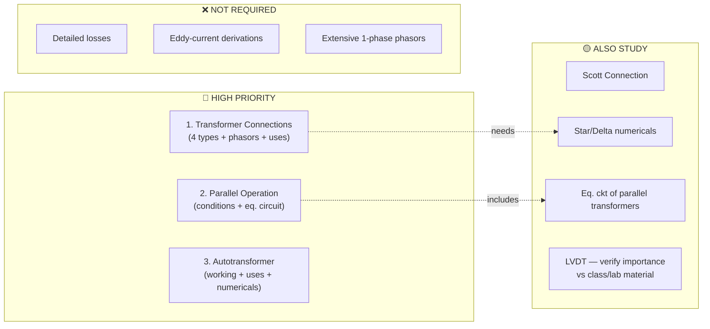
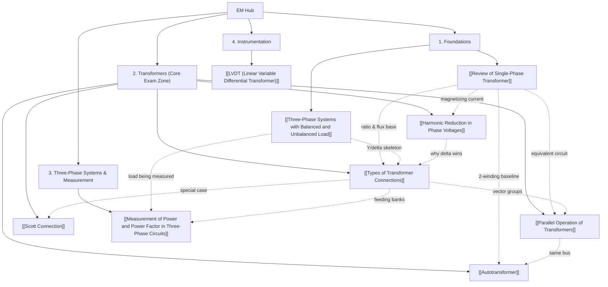

# ⚡ Electrical Machines — Midterm Study Hub

> [!SUMMARY] 🎓 Subject Master Index
> Welcome to the **EM Mid-Term Knowledge Vault**. Every note follows the vault standard: **human-first analogies**, **rigorous $\LaTeX$ math**, **step-by-step calculator-ready worked examples**, and **active recall self-tests**. This midterm is **transformer-centric**: the teacher's headline rule is *"Don't memorize blindly — understand the logic."* Questions will be mainly **reasoning/conceptual**, GATE/ESE-style 1–2 mark items.

---

## 🎯 Exam Priority Dashboard (from class discussion)

| Priority | Topic | What to nail |
| :--- | :--- | :--- |
| 🔴 1 | [[Types of Transformer Connections]] | Star-star / star-delta / delta-star / delta-delta, **phasor diagrams**, applications, reasoning |
| 🔴 2 | [[Parallel Operation of Transformers]] | Conditions, equivalent circuit, circulating current, load sharing |
| 🔴 3 | [[Autotransformer]] | Working, uses, copper saving, numericals |
| 🟡 | [[Scott Connection]] | 3φ↔2φ trick, 86.6% teaser turns |
| 🟡 | [[Harmonic Reduction in Phase Voltages]] | Triplen logic behind connection choices |
| 🟡 | [[LVDT (Linear Variable Differential Transformer)]] | Check class/lab material for exam weight |
| ❌ | — | Detailed losses, eddy-current derivations, extensive 1φ phasor drills |

> [!TIP] 🧠 Preparation strategy (teacher's own priority order)
> $$\boxed{\text{Connections} \rightarrow \text{Phasor diagrams} \rightarrow \text{Parallel operation} \rightarrow \text{Autotransformer} \rightarrow \text{Scott}}$$
> For **each connection**, know the full chain:
> **Connection → voltage/current relation → phase shift → phasor diagram → application → why/when used.**
> Practice numericals — they arm you for the reasoning questions.

---

## 🗺️ Knowledge Graph & Interactive Roadmap

---

## 📌 Midterm Syllabus Modules

### 1. Foundations
*Everything else stands on these two — make them automatic.*
- **[[Review of Single-Phase Transformer]]**: mutual-flux principle, the instant ratios ($E_2/E_1 = N_2/N_1$, currents inverse), EMF equation $E = 4.44fN\Phi_m$ and where 4.44 comes from, referred equivalent circuit, regulation in one sentence, and the *loss logic only* (core loss constant, copper loss ∝ $I^2$, max efficiency when they're equal — derivations explicitly out of scope).
- **[[Three-Phase Systems with Balanced and Unbalanced Load]]**: why 3-phase wins, star/delta $\sqrt3$ relationships, balanced-load collapse to per-phase analysis, unbalanced 4-wire vs 3-wire (neutral displacement, Millman), the 26.5 A neutral-current trap.

### 2. Transformers — the Core Exam Zone 🔴
*The teacher's priority order lives here.*
- **[[Types of Transformer Connections]]**: the four connections (Yy, Dd, Dy, Yd), the one phasor-subtraction skill that generates every table cell, ±30° shifts and vector-group clock notation, per-connection applications *with the why*, V-V open-delta 57.7%, and the worked Yd 9.53:1 winding-ratio example.
- **[[Harmonic Reduction in Phase Voltages]]**: why triplens are zero-sequence (3 × 120° = 360°), the delta "harmonic cemetery", Yy's isolated-neutral distortion (clean line voltages, dirty phase voltages), 3-limb core suppression, and all the one-line reasoning answers.
- **[[Parallel Operation of Transformers]]**: mandatory vs desirable conditions with one-line logic, the equivalent circuit, no-load circulating current $I_c = \frac{E_1-E_2}{Z_1+Z_2}$, per-unit impedance load division, common-base conversion drill, and the 50 A "does nothing but heat" shock example.
- **[[Autotransformer]]**: single shared winding, conducted vs transformed kVA split, copper saving $= 1-K$, kVA boosting ($S_{auto} = S_{2w}/(1-K)$), applications (motor starting, variac, 400/220 kV interconnection), and the no-isolation safety reasoning.
- **[[Scott Connection]]**: main + teaser, centre tap 50%, teaser 86.6% from the voltage-triangle altitude, 90° inherent shift, 11 kV/400 V numerical, and the "why fewer turns" favourite.

### 3. Three-Phase Systems & Measurement
*The load and the metering around the transformers.*
- **[[Measurement of Power and Power Factor in Three-Phase Circuits]]**: Blondel's theorem, two-wattmeter method ($W_1 = V_LI_L\cos(30°+\phi)$, $W_2 = \cos(30°-\phi)$), $\tan\phi = \sqrt3\frac{W_2-W_1}{W_2+W_1}$, the pf-vs-readings table (zero/negative readings), and the negative-reading protocol.

### 4. Instrumentation
- **[[LVDT (Linear Variable Differential Transformer)]]**: series-opposition secondaries, null + 180° phase direction trick, infinite resolution logic, sensitivity numerical, advantages/limits. ⚠️ *Exam weight uncertain — cross-check the class/lab material.*

---

## ⚡ High-Yield Revision Sheets
- **[[EM Formula Sheet]]**: one-page cheat sheet — connection table, $\sqrt3$ relations, parallel conditions, autotransformer saving formulas, wattmeter formulas. *(Planned — create when revising.)*

---

## 🔗 Cross-Subject Links
- The per-phase analysis trick used throughout connects to EMF: the 120° phasor geometry mirrors the vector-review machinery in [[Review of Vectors]].
- Iterative/reasoning discipline shared with the ANM vault: error-order thinking in [[Errors and Convergence]] parallels why numericals sharpen reasoning here.
- Complexity of load-division bookkeeping parallels [[Arrays]]-style index discipline in DSA.

