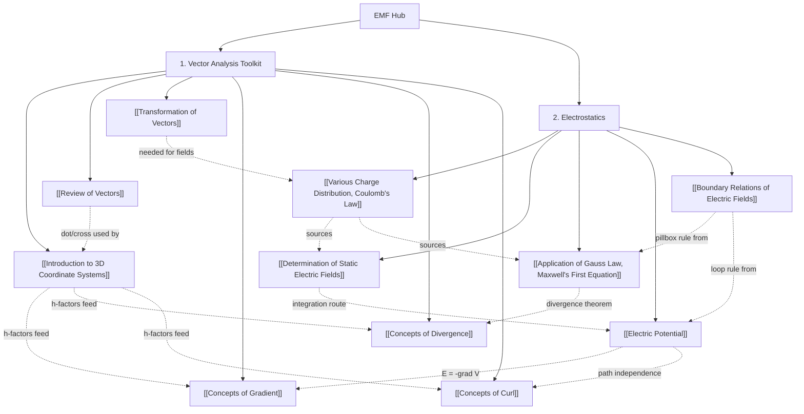

# ⚡ Electromagnetic Fields — Midterm Study Hub

> [!SUMMARY] 🎓 Subject Master Index
> Welcome to the **EMF Mid-Term Knowledge Vault**. Every note follows the vault standard: **human-first analogies** (terrains, paddle wheels, fluid flows), **rigorous $\LaTeX$ math**, **step-by-step calculator-ready worked examples**, and **active recall self-tests** with collapsible solutions.

---

## 🗺️ Knowledge Graph & Interactive Roadmap

---

## 📌 Midterm Syllabus Modules

### 1. Vector Analysis Toolkit
*The mathematical machinery — every electrostatics note below depends on it.*

- **[[Introduction to 3D Coordinate Systems]]**: the three systems (Cartesian/cylindrical/spherical), constant-coordinate surfaces, the $h$-factors $\rho\,d\phi$, $r\,d\theta$, $r\sin\theta\,d\phi$, differential length/volume elements, point-transformation dictionary, and choosing the right system for the geometry.
- **[[Review of Vectors]]**: scalars vs vectors, component form, the dot product (alignment, work, flux) and cross product (perpendicularity, area, torque), projection, the bac-cab rule, and distance vectors $\mathbf{R}_{12}$.
- **[[Transformation of Vectors]]**: same arrow, new components — the dot-with-new-basis recipe, all four conversion tables (Cart↔cylindrical, Cart↔spherical), why transformations need a point, and the magnitude-invariance check.
- **[[Concepts of Gradient]]**: steepest-ascent arrow, directional derivative $\nabla V\cdot\mathbf{a}_l$, level-surface orthogonality, coordinate forms with $1/\rho$ and $1/r$ factors, and the $\mathbf{E} = -\nabla V$ engine (Poisson/Laplace preview).
- **[[Concepts of Divergence]]**: net outflow per unit volume, sources/sinks/solenoidal fields, the del operator, coordinate forms, the divergence theorem, and $\nabla\cdot\mathbf{E} = \rho_v/\varepsilon$ (Maxwell's first equation's backbone).
- **[[Concepts of Curl]]**: circulation density and the paddle-wheel picture, determinant forms, Stokes' theorem, the vortex subtleties ($1/\rho$ drain vs rigid rotation), and why $\nabla\times\mathbf{E} = \mathbf{0}$ makes voltage well-defined.

### 2. Electrostatics
*From charge at rest to complete field maps — the Coulomb → Gauss → potential progression.*

- **[[Various Charge Distribution, Coulomb's Law]]**: charge quantization/conservation, the four distributions ($Q$, $\rho_L$, $\rho_S$, $\rho_v$), Coulomb's law with $\varepsilon_0$ and $k$, superposition, the slicing recipe, and the three prototype results (line $1/\rho$, sheet constant, sphere $1/r^2$).
- **[[Determination of Static Electric Fields]]**: the $\mathbf{E} = \mathbf{F}/q$ field concept, the three-strategy toolbox (integrate / Gauss / potential), the ring prototype with symmetry cancellation, the disc and dipole fields, and why components (not magnitudes) are integrated.
- **[[Application of Gauss Law, Maxwell's First Equation]]**: electric flux and $\mathbf{D} = \varepsilon\mathbf{E}$, the law $\oint\mathbf{D}\cdot d\mathbf{S} = Q_{enc}$, the 4-step symmetry recipe, the three canonical applications (point/sphere, line, sheet), fields inside uniform charge, and the point form $\nabla\cdot\mathbf{D} = \rho_v$.
- **[[Electric Potential]]**: potential as work per unit charge, the scalar-terrain picture, $V$ of the standard sources, path independence, the two golden relationships $\mathbf{E} = -\nabla V$ and $V = -\int\mathbf{E}\cdot d\mathbf{l}$, work/energy $W = q\Delta V$, and the line-charge logarithm warning.
- **[[Boundary Relations of Electric Fields]]**: the pillbox ($D_{1n} - D_{2n} = \rho_s$) and loop ($E_{1t} = E_{2t}$) conditions, conductor boundaries, field-line refraction $\frac{\tan\theta_2}{\tan\theta_1} = \frac{\varepsilon_2}{\varepsilon_1}$, and the "E-tangent, D-normal" protected pair.

---

## ⚡ High-Yield Revision Sheets
- **[[EMF Formula Sheet]]**: one-page cheat sheet — coordinate transformations, $\nabla$-operator forms, all field/potential formulas, boundary-condition table. *(Planned — create when revising.)*

---

## 🔗 Cross-Subject Links
- The $\nabla$ operators here share the "where-change" machinery with the ANM vault: partial derivatives and error ideas connect to [[Errors and Convergence]].
- The coordinate $h$-factors are the same arc-length logic used in Simpson/Trapezoidal panel widths — see [[Simpson's One-Third Rule]].

